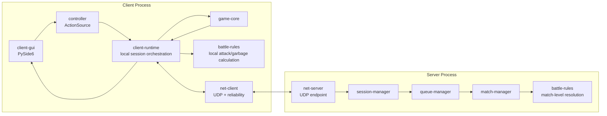

# P2P Tetris 概要設計

## 1. 文件目的

本文根據 `docs/proposal.md` 與設計討論結果，定義 `p2p-tetris` 的 MVP 概要設計。本文聚焦於模組劃分、模組責任、模組間關係、主要資料流與已確認的架構決策。

本文不定義所有底層數值與完整協定格式。攻擊表數值、垃圾延遲、hole 位置策略、SRS kick table 逐項 fixture、網路 snapshot 頻率等細節，應在後續詳細設計或任務切分階段固定，並以測試驗證。

## 2. 已確認設計決策

- GUI framework 採 PySide6。
- 對戰模式採 Tetris Friends Battle 2P 風格：2 分鐘限時，任一玩家先取得 3 次 KO 可提前獲勝；時間結束時依 KO 數、送出垃圾行數、結束盤面高度判定勝負。
- MVP 垃圾型態採傳統有洞 garbage，不採 bomb garbage。
- UDP 同步模型採低延遲優先的混合式方案：client 本地即時模擬自己的盤面，server 管理 match-level 狀態並發送輕量校正與可靠事件。
- active players 固定為 2。active players 之外的 waiting queue 預設容量為 5，超過時 server 回傳房間已滿。
- 打包工具以 `pyside6-deploy` 為首選，`PyInstaller` 作為備援方案。
- RL agent 不屬於 MVP，但主專案必須保留 `PlayerAction`、controller abstraction、game state snapshot 與 deterministic seed 接口。

## 3. 架構總覽

系統由一個 headless server process 與一個或多個 desktop client process 組成。單人模式只啟動 client，不需要 server。對戰模式由兩個 client 透過 UDP 連到同一個 server，由 server 負責 session、配對、等待隊列、match timer、KO 計分、可靠事件轉發與狀態校正。



核心原則：

- `game-core` 不依賴 GUI、network、server 或 PySide6。
- `battle-rules` 不依賴 GUI render 狀態，只處理規則事件與 match-level 結果。
- `controller` 只產生玩家動作，不直接修改 GUI 或網路狀態。
- `client-gui` 顯示 view model，不承載核心規則。
- `server` 不需要知道玩家是人類、測試腳本或未來 RL agent。
- `net-client` 與 `net-server` 只處理封包、session、序號、ack、重送與狀態同步，不直接實作 Tetris 規則。

## 4. 建議程式結構

```text
src/p2p_tetris/
  common/
    config.py
    ids.py
    time.py
  game_core/
    actions.py
    board.py
    engine.py
    pieces.py
    randomizer.py
    rotation.py
    snapshots.py
  battle/
    attack.py
    garbage.py
    match_rules.py
    scoring.py
  controllers/
    base.py
    keyboard.py
    scripted.py
  client/
    app.py
    local_session.py
    versus_session.py
    view_models.py
  gui/
    main_window.py
    screens.py
    game_view.py
    theme.py
  net/
    protocol.py
    reliability.py
    udp_client.py
    udp_server.py
  server/
    app.py
    queue.py
    sessions.py
    matches.py
  packaging/
    pyside6_deploy/
    pyinstaller/
```

實際檔名可在任務切分時調整，但模組邊界應保持一致。

## 5. 模組劃分

| 模組 | 主要責任 | 對外接口 | 不負責 |
| --- | --- | --- | --- |
| `common` | 共用 ID、config、時間工具、不可變設定資料 | `GameConfig`, `MatchConfig`, `NetworkConfig`, ID types | 規則判定、GUI、網路 IO |
| `game-core` | 盤面、方塊、碰撞、SRS、hold、next queue、ghost piece、gravity、lock、line clear、top-out | `PlayerAction`, `GameEngine`, `GameStateSnapshot`, `ClearEvent` | 對戰 KO、server 配對、GUI |
| `battle-rules` | attack 計算、有洞 garbage、garbage 抵銷或延遲、KO、回合勝負 | `AttackEvent`, `GarbageEvent`, `MatchResult`, `WinnerResolver` | 方塊碰撞、鍵盤輸入、UDP |
| `controllers` | 將不同 action source 轉成同一組 `PlayerAction` | `ActionSource`, `KeyboardController`, `ScriptedController` | 直接修改遊戲狀態、渲染 |
| `client-runtime` | client 端單人/對戰 session orchestration、本地 game loop、view model 更新、網路事件套用 | `LocalGameSession`, `VersusGameSession` | 低階 UDP socket、server queue |
| `client-gui` | PySide6 視窗、畫面、輸入綁定、遊戲資訊展示 | `MainWindow`, `GameView`, screen widgets | 核心規則與 network reliability |
| `net` | UDP 封包收發、message schema、session id、序號、ack、重送、snapshot 校正 | `UdpClient`, `UdpServer`, `ProtocolMessage`, `ReliableChannel` | 配對規則、方塊規則 |
| `server` | client session、waiting queue、active match、車輪戰、match timer、KO 計分、可靠事件轉發 | `ServerApp`, `QueueManager`, `MatchManager` | GUI、完整本地玩家操作手感 |
| `packaging` | Linux/Windows 打包設定與入口 | `pyside6-deploy` spec, PyInstaller spec | 遊戲規則 |
| `tests` | 單元、整合、協定、server/client 測試 | pytest fixtures, deterministic seeds | runtime feature |

## 6. 核心資料模型

### 6.1 PlayerAction

`PlayerAction` 是真人、測試腳本與未來 RL agent 共用的遊戲內 action enum。MVP 包含：

- `NO_OP`
- `MOVE_LEFT`
- `MOVE_RIGHT`
- `SOFT_DROP`
- `HARD_DROP`
- `ROTATE_CW`
- `ROTATE_CCW`
- `HOLD`

pause、restart、connect、quit 屬於系統控制，不放入 RL action space。

### 6.2 GameStateSnapshot

`game-core` 對外提供只讀 snapshot，供 GUI、測試、net-client 狀態摘要與未來 RL observation 使用。snapshot 至少包含：

- board 可見區與必要 hidden buffer 狀態摘要。
- active piece 類型、位置、旋轉狀態。
- ghost piece 位置。
- hold piece。
- next queue。
- combo 與 back-to-back 狀態。
- score、cleared lines、top-out 狀態。
- pending garbage 或自身壓力提示。

snapshot 應避免暴露不該由玩家或 RL agent 讀取的隱藏資訊，例如對手 random seed。

### 6.3 Battle Events

`game-core` 在消行或 top-out 時產生規則事件，交由 `battle-rules` 解讀：

- `ClearEvent`: 消行數、是否 T-spin、combo index、B2B 狀態。
- `AttackEvent`: 本次攻擊產生的 garbage lines、來源 player、序號。
- `GarbageEvent`: server 或本地規則要求套用的 incoming garbage。
- `KOEvent`: 玩家 top-out 後產生的 KO 訊號。
- `RespawnEvent`: 被 KO 玩家重生並繼續同一回合。

攻擊數值與垃圾延遲屬於詳細設計，但事件邊界在本階段固定。

## 7. 遊戲核心設計

`game-core` 使用 deterministic fixed tick 推進，避免 GUI frame rate 影響規則。GUI 與 controller 可以較高頻率接收輸入，但核心狀態只在 tick 邊界更新。

`GameEngine` 的主要操作：

- `reset(seed, config)` 初始化遊戲。
- `step(actions, dt_or_ticks)` 套用 action 並推進 simulation。
- `snapshot()` 回傳只讀狀態。
- `apply_garbage(garbage_event)` 套用對戰垃圾。

核心規則：

- 盤面可見區為 10 x 20，內部允許 hidden buffer。
- randomizer 採 7-bag 作為 MVP 方向。
- 旋轉採 SRS；完整 kick table 以測試 fixture 固定。
- 支援 hold、next queue、ghost piece、soft drop、hard drop。
- 支援 lock delay 或等效機制；精確時間值後續設定。
- line clear 後更新 combo、B2B 與事件輸出。
- top-out 只表示該局部生命結束；對戰是否結束由 `battle-rules` / `server` 判定。

## 8. 對戰規則設計

`battle-rules` 將核心消行事件轉為對戰壓力，並處理 match-level 結果。

MVP match 規則：

- 每場 match 同時 2 名 active players。
- match 時間預設 120 秒，可配置。
- top-out 視為被 KO。
- 被 KO 玩家在同一 match 中重生並繼續遊玩。
- 任一玩家先取得 3 KO，match 提前結束。
- 若時間結束無人達 3 KO，依 KO 數、sent garbage lines、結束盤面高度判定勝負。
- 若所有 tie-breaker 仍相同，結果可標為 draw；是否需要額外 tie-breaker 留到詳細設計。

MVP garbage 規則：

- garbage 型態為傳統有洞 garbage。
- incoming garbage 應可延遲套用，避免剛收到封包就立即破壞當前操作手感。
- outgoing attack 可先抵銷 pending incoming garbage，再將剩餘攻擊送給對手。
- hole 位置策略必須 deterministic 或可注入 random seed，以便測試。
- bomb garbage 不納入 MVP，但 `GarbageGenerator` 應避免把資料模型寫死到只支援有洞 garbage。

## 9. Client Runtime 設計

client runtime 分為單人 session 與對戰 session。

### 9.1 單人 Session

資料流：

```text
KeyboardController -> LocalGameSession -> GameEngine -> GameStateSnapshot -> PySide6 GUI
```

單人模式不啟動 `net-client`，也不依賴 server。它負責：

- 啟動或重置單人 `GameEngine`。
- 處理 pause / resume / restart。
- 根據固定 tick 推進遊戲。
- 將 snapshot 轉成 GUI view model。

### 9.2 對戰 Session

資料流：

```text
KeyboardController -> VersusGameSession -> local GameEngine -> immediate GUI update
VersusGameSession <-> NetClient <-> Server
Server -> reliable garbage / KO / match snapshot -> VersusGameSession
```

對戰模式中，自己的盤面由 client 本地即時模擬，確保鍵盤操作低延遲。server 不阻塞本地移動、旋轉、soft drop、hard drop。

`VersusGameSession` 負責：

- 使用 server 下發的 match config 與 seed 初始化本地遊戲。
- 套用本地 `PlayerAction` 並立即更新 GUI。
- 將消行、attack、top-out、state summary 傳給 server。
- 接收 server 下發的 reliable garbage event、KO event、opponent summary、match snapshot。
- 對 server snapshot 做輕量校正，避免普通掉包造成永久不同步。

## 10. PySide6 GUI 設計

`client-gui` 採 PySide6，對核心規則只依賴 view model 與 action callback。

主要畫面：

- Main menu: Single Player、Connect to Server、Play with Computer disabled、Exit。
- Connect screen: server IP、port、player name、連線狀態。
- Waiting screen: active / waiting 狀態、房間滿或被拒絕訊息。
- Solo game screen: 自己盤面、hold、next queue、score、lines、pause / restart。
- Versus game screen: 自己盤面、對手摘要、hold、next queue、incoming garbage、timer、KO count、sent lines。
- Match result screen: winner、KO、sent lines、下一場狀態。

GUI 內部建議保留 `GameViewRenderer` 邊界。MVP 可使用 PySide6 Widgets 與自訂 game view 繪製盤面；若後續 UI 設計需要更強動畫或 shader-like 效果，可在不影響 `game-core` 的前提下替換渲染實作。

GUI loop 不直接跑 blocking network IO。網路事件應透過 thread-safe queue、Qt signal 或非阻塞 polling 交給 `client-runtime`。

## 11. UDP 與同步設計

MVP 採 UDP，不處理 NAT traversal。協定必須具備 session id、match id、message sequence、ack、重送與重複封包去重。

### 11.1 狀態歸屬

| 狀態 | 主要擁有者 | 說明 |
| --- | --- | --- |
| 本地方塊移動與盤面 | client | client 即時模擬，避免輸入延遲 |
| match timer | server | server 作為回合時間來源 |
| active players / waiting queue | server | server 決定配對與房間滿 |
| KO count / sent lines | server | server 收事件後更新 match-level 狀態 |
| incoming garbage event | server | server 分配序號並可靠下發 |
| opponent summary | server relay | 由對手 client 摘要上報，server 轉發 |
| 最終勝負 | server | server 根據 match 狀態判定 |

### 11.2 Message Groups

Session messages：

- `ClientHello`
- `ServerWelcome`
- `JoinRejectedRoomFull`
- `Heartbeat`
- `DisconnectNotice`

Queue / match messages：

- `QueueStatus`
- `MatchStart`
- `MatchSnapshot`
- `MatchEnd`
- `PlayerLeft`

Reliable gameplay events：

- `AttackReported`
- `GarbageAssigned`
- `KOReported`
- `RespawnAssigned`
- `ReliableAck`
- `ReliableResendRequest`

State summary messages：

- `ClientStateSummary`
- `OpponentStateSummary`
- `ClockSync`

具體 wire encoding 可在詳細協定設計中決定，但 message schema 必須以 typed dataclass 或等效結構在程式內表示，避免在業務邏輯中散落 ad hoc dict。

### 11.3 Reliability

可靠事件必須包含：

- `session_id`
- `match_id`
- `sender_id`
- `event_seq`
- `ack_seq` 或 ack list
- `sent_at`
- payload

接收端應記錄已處理事件序號，重複封包只 ack 不重複套用。未 ack 的可靠事件由發送端重送，直到 ack 或 session timeout。

普通狀態摘要可不可靠傳輸，因為下一個 snapshot 會覆蓋舊狀態。

## 12. Server 設計

server 是 headless component，可獨立啟動。

主要子模組：

- `UdpServer`: UDP socket、封包 decode / encode、非阻塞事件 loop。
- `SessionManager`: client session id、heartbeat、timeout、重複加入處理。
- `QueueManager`: active slots 與 waiting queue。active 固定 2，waiting 預設 5。
- `MatchManager`: match lifecycle、match timer、match snapshot、match end。
- `ReliableEventRouter`: reliable event sequence、ack、重送、去重。
- `BattleCoordinator`: KO、sent lines、garbage assignment、winner resolution。

車輪戰流程：

1. 新 client 加入。
2. 若 active 未滿，進入 active pool；若 active 已滿且 waiting 未滿，進入 waiting queue。
3. 若 active 與 waiting 都滿，回傳 `JoinRejectedRoomFull`。
4. active player 達 2 人時啟動 match。
5. match 結束後，輸家離開 active match；等待隊列第一名進入下一局。
6. 若有人中途離線，server 清理 session，必要時結束 match 或由等待玩家補位到下一局。

## 13. Packaging 設計

專案保留兩個 entrypoint：

- client GUI entrypoint。
- headless server entrypoint。

首選打包方式：

- 使用 `pyside6-deploy` 打包 PySide6 client。
- server 若不依賴 GUI，可使用同一套流程或較輕量的 Python executable packaging 流程。

備援方案：

- 若 `pyside6-deploy` 在 Linux 或 Windows 的 PySide6 plugin 收集上遇到阻塞，使用 `PyInstaller` spec 作為 fallback。

打包驗收：

- Linux 可啟動 client。
- Windows 可啟動 client。
- server 可獨立啟動。
- 文件說明本機啟動 server + 2 client 的流程。

## 14. RL 預留接口

MVP 不實作 RL environment、training 或 agent inference，但必須保留以下接口：

- `PlayerAction` 不綁定鍵盤。
- `ActionSource` 可由 keyboard、scripted test、future agent controller 實作。
- `GameEngine.reset(seed, config)` 可重現。
- `GameEngine.step(...)` 不依賴 GUI。
- `GameStateSnapshot` 提供足夠資訊建立 future observation。
- `battle-rules` 不依賴 GUI render state。
- server 視 agent-controlled client 為一般 client。

未來 RL 子項目可新增：

- `rl-env`
- `rl-wrappers`
- `rl-train`
- `rl-eval`
- `agent-controller`

這些模組不得成為主遊戲 MVP 的必要安裝依賴。

## 15. 測試設計

單元測試：

- `game-core`: 7-bag、piece movement、SRS、collision、lock、line clear、hold、next queue、ghost、top-out。
- `battle-rules`: attack calculation、garbage cancel、garbage apply、KO、winner resolution。
- `controllers`: keyboard mapping 與 scripted action source 都輸出同一組 `PlayerAction`。
- `net`: sequence、ack、重送、重複封包去重、session id 混淆防護。

整合測試：

- 單人 session 可 deterministic 推進。
- server 可接受兩個 mock client 並配對。
- match start / match end / winner resolution。
- room full 時第 8 名連線被拒絕：2 active + 5 waiting 已滿。
- reliable garbage event 在掉包後可重送，不造成永久卡死。
- client local event 與 server snapshot 校正流程可執行。

品質檢查：

```bash
uv run ruff check .
uv run mypy .
uv run pytest
```

## 16. 待詳細設計項目

以下項目不在本文中猜測最終數值，但必須在實作前或對應任務中定義並測試：

- 完整 SRS kick table fixture。
- lock delay、DAS / ARR 或等效鍵盤手感參數。
- T-spin 偵測規則。
- attack table 數值。
- garbage 抵銷順序、延遲套用時間、hole 位置策略。
- top-out 後 respawn delay 與重生盤面初始狀態。
- UDP wire encoding。
- reliable event 重送間隔、heartbeat interval、timeout。
- match snapshot 頻率與校正策略。
- PySide6 game view 的具體 rendering 實作與視覺風格。
- Linux / Windows 實際打包命令與 CI 流程。
